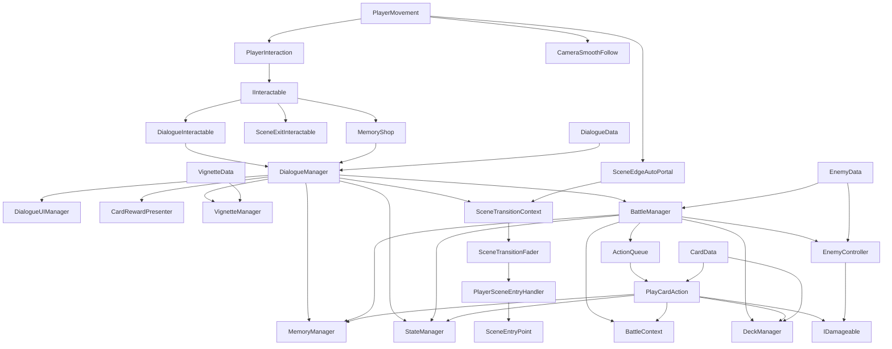
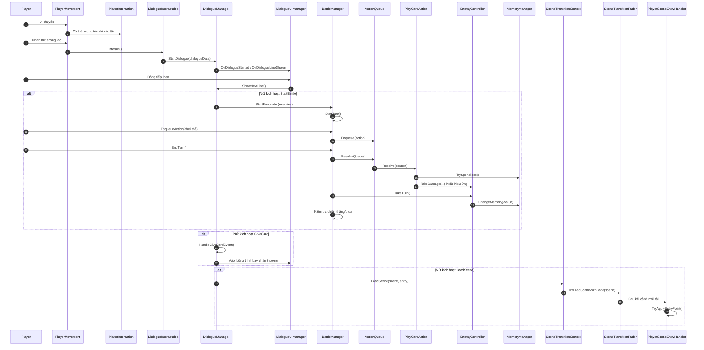
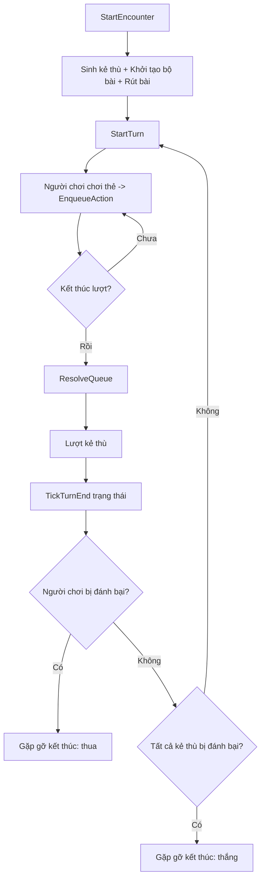

# Luồng Gameplay dùng Mermaid

Ngày cập nhật: 2026-04-14  
Phạm vi: `Assets/_Project/Gameplay/Scripts`

Tài liệu này tập trung vào luồng và quan hệ giữa các hệ thống, để bạn nhìn nhanh đường đi dữ liệu và chuỗi gọi hàm.

## 1) Kiến trúc tổng quan

## 2) Chuỗi chính: Khám phá → Hội thoại → Chiến đấu → Phần thưởng → Cảnh

## 3) Biểu đồ luồng theo giai đoạn chiến đấu

## 4) Ghi chú đọc biểu đồ

1. `SceneTransitionContext` là điểm vào chung cho chuyển cảnh, có quan hệ chặt chẽ với `SceneTransitionFader` và `PlayerSceneEntryHandler`.
2. `BattleContext` là một tham chiếu được truyền vào hành động khi giải quyết, để tránh hành động phải tìm quản lý ở nhiều nơi.
3. `PlayCardAction` là trung tâm xử lý hiệu ứng thẻ; được cung cấp bởi `ActionQueue` và `BattleManager`.
4. `MemoryManager` đang là tài nguyên liên tục: được sử dụng trong chi phí thẻ, tấn công kẻ thù bộ nhớ, khóa mở hội thoại mảnh.
